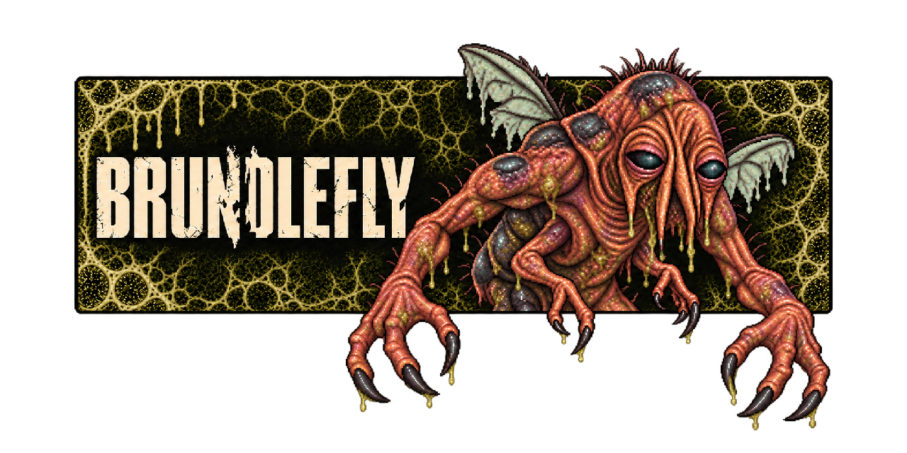

# Brundlefly

A collection of self-contained Agent Skills for writing and repository work.

## Why Brundlefly

A tutorial can read well and still give you a broken command.
A PR can sound natural and still miss the target repository's conventions.

[Humanizer](https://github.com/blader/humanizer/blob/225a6f39ac85f76ee48dbad772ea4abe4ed6c9d8/SKILL.md)
and [Stop Slop](https://github.com/hardikpandya/stop-slop/blob/8da1f030185bdfe8471220585162991eaeb970e9/SKILL.md) focus on prose editing.
Brundlefly combines that work with checking guide examples and preparing submissions for the repository you're working in.

Install it when your agent needs to carry developer writing through to a usable guide or review submission.
The skills preserve facts and voice, inspect the target project's rules, and report checks they could not run.
Each skill carries its own references, so the workflows travel between repositories without a personal checkout or private services.

## Features

- ✍️ **[write-human](skills/write-human/SKILL.md):** edit generated-sounding prose while preserving facts, uncertainty, and voice.
- 📖 **[technical-guide](skills/technical-guide/SKILL.md):** give readers supported instructions with checked examples and stated verification limits.
- 🔀 **[pr](skills/pr/SKILL.md):** prepare review submissions that follow the target repository's rules and templates.
- 🗜️ **[agentify-text](skills/agentify-text/SKILL.md):** reduce tokens while preserving facts, constraints, and working links.
- 🧾 **[readme](skills/readme/SKILL.md):** explain a project's value and setup using bundled write-human rules.

## Setup

Use an agent that supports the [Agent Skills format](https://agentskills.io/specification).
Clone this repository with Git, then run the examples from its root:

```sh
git clone https://github.com/harlan-zw/brundlefly.git
cd brundlefly
```

Copy the skill collection into your agent's supported skills directory.
For Codex on Linux or macOS:

If matching skill directories already exist in ~/.agents/skills, review them before replacing them.
Run this copy command when those destinations are absent.

```sh
mkdir -p ~/.agents/skills
cp -R skills/. ~/.agents/skills/
```

The copy includes each skill's instructions, references, and license.
Your agent reads the descriptions to find the skill that matches your request.
It loads that skill's full instructions when the task calls for them.
See [how Agent Skills work](https://agentskills.io/home#how-do-agent-skills-work).

Ask your agent:

```text
Refresh README.md. Follow this repository's conventions and verify the setup examples.
```

If you already have skilld, load the instructions without installing the skill:

```sh
skilld run ./skills/readme --json
```

This prints the skill instructions and supporting-file read commands. It writes no installed skill files.
Pass the instructions to your agent and read the references they name.

## Guides

### Skills

Describe the outcome you want. Your agent selects a skill from its description.
You can name a skill when you want to request it explicitly.

```text
Edit this draft. Preserve its facts, uncertainty, and voice.
Refresh this tutorial against the supported release. Verify its examples.
Submit these changes as a PR. Follow the repository template and recent maintainer conventions.
Reduce tokens in this Markdown file. Preserve its rules, exceptions, and working links.
```

GitHub publication through pr needs an authorized GitHub integration.
Technical-guide uses the target project's tools and reports unavailable checks.
Keep personal stories in their author's voice.

For writing comparisons and local demos, read the [pilot instructions](evals/README.md)
and [review UI setup](evals/ui/README.md).
The [quality plan](docs/ideas/skill-quality.md) explains comparison scope and human review requirements.

### Brand assets

Use the [README banner](assets/brand/github-banner-overhang-gross.png),
[GitHub avatar](assets/brand/github-avatar.png), or [social preview](assets/brand/github-social-preview.jpg).
Read the [brand rules](docs/arch/brand.md) before changing artwork.
The [character sheet](assets/brand/character-sheet.png) supplies anatomy references.

High-resolution originals live in assets/source. Earlier concepts live in assets/archive.
Generation prompts live in assets/prompts.

## Contribute

Read [CONTRIBUTING.md](CONTRIBUTING.md) before adding a skill.
Each skill must work when its directory is copied alone.

## License

The skill instructions use the [MIT license](LICENSE.md).
