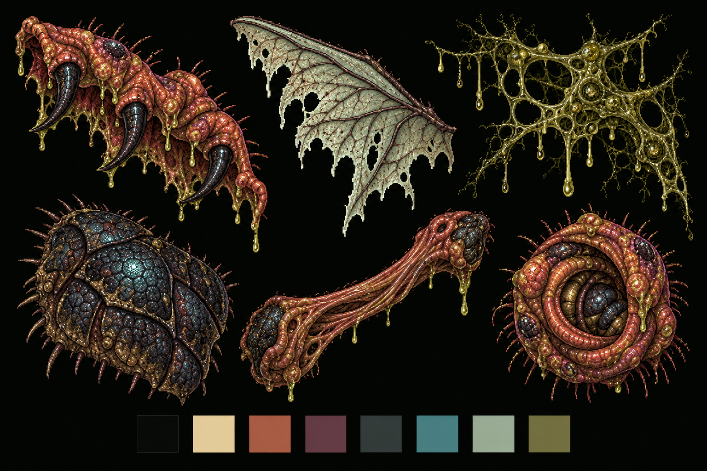

# Brundlefly brand kit

This kit translates the canonical mascot into an interactive material system.
[Brand rules](../arch/brand.md) control anatomy and identity.
[COPY.md](../../website/COPY.md) controls public language.

## Identity

Keep the hunched adult, four arms, two legs, and two unequal developing wings.
Keep folded rusty flesh, dark chitin, bristles, and blue-black eyes with tiny teal reflections.
Use the supplied raster wordmark. Never recreate its lettering.
No cute proportions, orange eyes, blood spray, clothing, or exposed organs.
Materials may exist alone. They must never imply a different mascot anatomy.

## Artifact register

Paths below are relative to the repository root.

| Artifact | File | Use |
| --- | --- | --- |
| Canonical full-arm banner | assets/brand/github-banner-overhang-gross.png | Primary identity, preserve the entire silhouette |
| Avatar | assets/brand/github-avatar.png | Compact identity |
| Character | assets/brand/character.png | Full anatomy reference |
| Character sheet | assets/brand/character-sheet.png | Pose and material reference |
| Social preview | assets/brand/github-social-preview.jpg | Link previews |
| Earlier banner | assets/brand/github-banner.png | Existing alternate, canonical gross banner takes priority |
| Earlier overhang | assets/brand/github-banner-overhang.png | Existing alternate, do not substitute on the tool page |
| Material board, 1536 × 1024 | assets/brand/kit/material-board.png | Flesh rim, wing, mucus, chitin, tendon, aperture reference |
| Instrument surround, 1536 × 1024, RGBA | assets/brand/kit/instrument-surround.png | Irregular outer boundary of the work area |
| Aperture, 1254 × 1254, RGBA | assets/brand/kit/aperture.png | Idle output and interaction feedback |
| High-resolution masters | assets/source/* | Original production masters, retain unchanged |
| Historical concepts | assets/archive/* | Inspiration only; no authority over anatomy or copy |
| Generation prompts | assets/prompts/* | Reproduction and provenance |
| Design tokens and rules | website/DESIGN.md | Code-facing implementation contract |
| Interface materials and motion | website/app/assets/css/main.css | Live layout, tendons, hover slime, focus and reduced motion |

New kit images were generated from canonical artwork with image generation.
They extend materials, not the mascot or wordmark.
Keep original PNG alpha. Use pixelated rendering. Do not stretch the aspect ratio.
The board is documentation, not a sprite atlas. Use the separate production files on the page.

## Palette

| Material | Hex | Interface role |
| --- | --- | --- |
| Night | #080B08 | Quiet work area |
| Cream | #E8D4A6 | Text, primary action, focus |
| Flesh | #AA604B | Hover and organic edges |
| Bruise | #69404B | Wording highlights |
| Chitin | #343C3B | Dividers and structural surfaces |
| Eye | #418B90 | Small active-state glint |
| Wing | #A4B5A0 | Secondary text and membrane |
| Olive | #777648 | Slime, never body text |

## Type and space

IBM Plex Mono names controls and generated output.
IBM Plex Sans carries editable text. Barlow Condensed is available for functional headings.
The raster banner carries the identity. Avoid oversized marketing headings.
Use 16px editable text, 14px control labels, and 44px minimum targets.
Keep artwork outside editable areas. Leave more darkness than ornament.

## Layout explorations

| Direction | Composition | Decision |
| --- | --- | --- |
| Living instrument | Asymmetric surround; controls attach to its edge; input and output occupy the opening | Selected, immediate work and a strong physical identity |
| Specimen drawer | Separate specimens open vertically into work surfaces | Reserve, adds navigation before the task |
| Wing map | Skill controls sit on a branching membrane with floating input | Reserve, impressive but weaker mobile reading order |

## Tool page contract

One instrument, three skills. No hero pitch, feature cards, testimonials, or decorative slogans.
Show the exact skill names. Keep the selected skill, editable input, and action immediately visible.
The empty output displays the aperture. A real result replaces it.
Skill changes reset the work area. Editing input clears stale output.
Downloads and instructions remain secondary, beneath the instrument.
On mobile, retain the surrounding artwork but stack input above output.

## Motion and interaction

The aperture breathes slowly when idle. Hover compresses its tissue.
The surround stays still. Active skill controls acquire a teal glint and a cream underline.
Slime grows below the primary action on hover, outside its text.
Motion off and system reduced motion stop animations and transitions.
The organic silhouette never changes focus order or blocks clicks.

## Limits

These are local workflow demos, not remote agent execution.
Writing signals invite review. They cannot identify an author.
The guide demo produces a structure. The PR demo formats a draft.
Keep these limits in an expandable disclosure near the work area.

## Complete file inventory

| File | Dimensions or type | Role |
| --- | --- | --- |
| [assets/archive/brand-kit/avatar-master-v2.png](../../assets/archive/brand-kit/avatar-master-v2.png) | 1254 × 1254 | Historical |
| [assets/archive/brand-kit/avatar-master.png](../../assets/archive/brand-kit/avatar-master.png) | 1254 × 1254 | Historical |
| [assets/archive/brand-kit/avatar-preview-32.png](../../assets/archive/brand-kit/avatar-preview-32.png) | 32 × 32 | Historical |
| [assets/archive/brand-kit/avatar-preview-48.png](../../assets/archive/brand-kit/avatar-preview-48.png) | 48 × 48 | Historical |
| [assets/archive/brand-kit/avatar-preview-96.png](../../assets/archive/brand-kit/avatar-preview-96.png) | 96 × 96 | Historical |
| [assets/archive/brand-kit/avatar-refinement-prompt.txt](../../assets/archive/brand-kit/avatar-refinement-prompt.txt) | Reference file | Historical |
| [assets/archive/brand-kit/banner-arm-fix-prompt.txt](../../assets/archive/brand-kit/banner-arm-fix-prompt.txt) | Reference file | Historical |
| [assets/archive/brand-kit/banner-master-v2.png](../../assets/archive/brand-kit/banner-master-v2.png) | 1774 × 887 | Historical |
| [assets/archive/brand-kit/banner-master.png](../../assets/archive/brand-kit/banner-master.png) | 1774 × 887 | Historical |
| [assets/archive/brand-kit/brand-guide.md](../../assets/archive/brand-kit/brand-guide.md) | Reference file | Historical |
| [assets/archive/brand-kit/brundlefly-brand-kit.zip](../../assets/archive/brand-kit/brundlefly-brand-kit.zip) | Reference file | Historical |
| [assets/archive/brand-kit/canonical-character.png](../../assets/archive/brand-kit/canonical-character.png) | 1199 × 1312 | Historical |
| [assets/archive/brand-kit/character-sheet.png](../../assets/archive/brand-kit/character-sheet.png) | 1536 × 1024 | Historical |
| [assets/archive/brand-kit/generation-prompts.json](../../assets/archive/brand-kit/generation-prompts.json) | Reference file | Historical |
| [assets/archive/brand-kit/github-avatar-v2.png](../../assets/archive/brand-kit/github-avatar-v2.png) | 500 × 500 | Historical |
| [assets/archive/brand-kit/github-avatar.png](../../assets/archive/brand-kit/github-avatar.png) | 500 × 500 | Historical |
| [assets/archive/brand-kit/github-banner-v2.png](../../assets/archive/brand-kit/github-banner-v2.png) | 1280 × 640 | Historical |
| [assets/archive/brand-kit/github-banner.png](../../assets/archive/brand-kit/github-banner.png) | 1280 × 640 | Historical |
| [assets/archive/brand-kit/github-social-preview-v2.jpg](../../assets/archive/brand-kit/github-social-preview-v2.jpg) | Reference file | Historical |
| [assets/archive/brand-kit/github-social-preview.jpg](../../assets/archive/brand-kit/github-social-preview.jpg) | Reference file | Historical |
| [assets/archive/concepts/brundlefly-brand-board.png](../../assets/archive/concepts/brundlefly-brand-board.png) | 1536 × 1024 | Historical |
| [assets/archive/concepts/brundlefly-mascot.png](../../assets/archive/concepts/brundlefly-mascot.png) | 1235 × 1274 | Historical |
| [assets/archive/concepts/brundleware-mascot.png](../../assets/archive/concepts/brundleware-mascot.png) | 1235 × 1274 | Historical |
| [assets/archive/concepts/fleshware-brand-board.png](../../assets/archive/concepts/fleshware-brand-board.png) | 1536 × 1024 | Historical |
| [assets/archive/concepts/fleshware-mascot.png](../../assets/archive/concepts/fleshware-mascot.png) | 1312 × 1199 | Historical |
| [assets/archive/concepts/spiralware-brand-board.png](../../assets/archive/concepts/spiralware-brand-board.png) | 1536 × 1024 | Historical |
| [assets/archive/concepts/spiralware-mascot.png](../../assets/archive/concepts/spiralware-mascot.png) | 1230 × 1278 | Historical |
| [assets/archive/splashes/01-crouched.png](../../assets/archive/splashes/01-crouched.png) | 1536 × 1024 | Historical |
| [assets/archive/splashes/02-mid-mutation.png](../../assets/archive/splashes/02-mid-mutation.png) | 1536 × 1024 | Historical |
| [assets/archive/splashes/03-wing-spread.png](../../assets/archive/splashes/03-wing-spread.png) | 1536 × 1024 | Historical |
| [assets/archive/splashes/04-six-limb-character.png](../../assets/archive/splashes/04-six-limb-character.png) | 1199 × 1312 | Historical |
| [assets/brand/character-sheet.png](../../assets/brand/character-sheet.png) | 1536 × 1024 | Current |
| [assets/brand/character.png](../../assets/brand/character.png) | 1199 × 1312 | Current |
| [assets/brand/github-avatar.png](../../assets/brand/github-avatar.png) | 500 × 500 | Current |
| [assets/brand/github-banner-overhang-gross.png](../../assets/brand/github-banner-overhang-gross.png) | 1280 × 640 | Current |
| [assets/brand/github-banner-overhang.png](../../assets/brand/github-banner-overhang.png) | 1280 × 640 | Current |
| [assets/brand/github-banner.png](../../assets/brand/github-banner.png) | 1280 × 640 | Current |
| [assets/brand/github-social-preview.jpg](../../assets/brand/github-social-preview.jpg) | Reference file | Current |
| [assets/brand/kit/aperture.png](../../assets/brand/kit/aperture.png) | 1254 × 1254 | Current |
| [assets/brand/kit/instrument-surround.png](../../assets/brand/kit/instrument-surround.png) | 1536 × 1024 | Current |
| [assets/brand/kit/material-board.png](../../assets/brand/kit/material-board.png) | 1536 × 1024 | Current |
| [assets/manifest.json](../../assets/manifest.json) | Reference file | Current |
| [assets/previews/avatar-32.png](../../assets/previews/avatar-32.png) | 32 × 32 | Current |
| [assets/previews/avatar-48.png](../../assets/previews/avatar-48.png) | 48 × 48 | Current |
| [assets/previews/avatar-96.png](../../assets/previews/avatar-96.png) | 96 × 96 | Current |
| [assets/prompts/avatar-refinement.txt](../../assets/prompts/avatar-refinement.txt) | Reference file | Prompt |
| [assets/prompts/banner-arm-fix.txt](../../assets/prompts/banner-arm-fix.txt) | Reference file | Prompt |
| [assets/prompts/banner-overhang-gross.txt](../../assets/prompts/banner-overhang-gross.txt) | Reference file | Prompt |
| [assets/prompts/banner-overhang.txt](../../assets/prompts/banner-overhang.txt) | Reference file | Prompt |
| [assets/prompts/brand-kit.json](../../assets/prompts/brand-kit.json) | Reference file | Prompt |
| [assets/prompts/character.txt](../../assets/prompts/character.txt) | Reference file | Prompt |
| [assets/prompts/generation-prompts.json](../../assets/prompts/generation-prompts.json) | Reference file | Prompt |
| [assets/prompts/initial-concepts.json](../../assets/prompts/initial-concepts.json) | Reference file | Prompt |
| [assets/prompts/splashes.json](../../assets/prompts/splashes.json) | Reference file | Prompt |
| [assets/source/avatar-master.png](../../assets/source/avatar-master.png) | 1254 × 1254 | Master |
| [assets/source/banner-master.png](../../assets/source/banner-master.png) | 1774 × 887 | Master |
| [assets/source/banner-overhang-gross-master.png](../../assets/source/banner-overhang-gross-master.png) | 1774 × 887 | Master |
| [assets/source/banner-overhang-master.png](../../assets/source/banner-overhang-master.png) | 1774 × 887 | Master |
