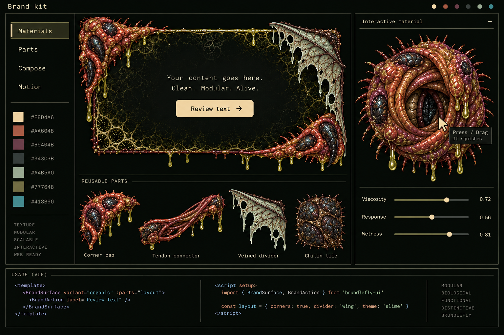
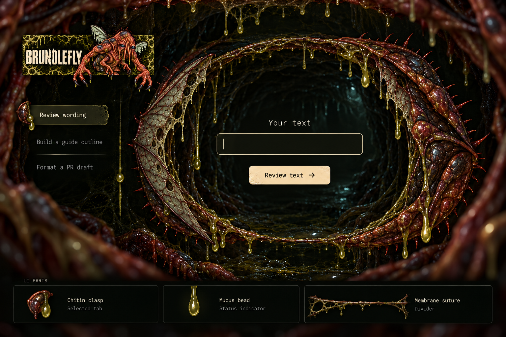
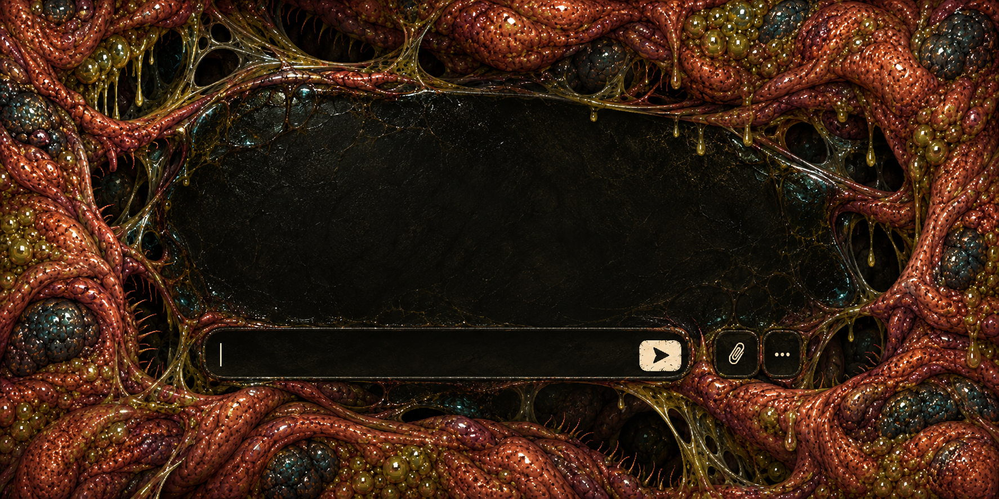

# Brundlefly brand kit

This kit supplies composable Nuxt parts, material artwork, a complete 3D lair, and the articulated Brundlefly relief.

Open the website’s /brand-kit/ app to compose parts and copy Vue or JSON presets.
Download the complete Nuxt layer there. [Layer source](../../website/layers/brand/README.md) defines installation and component APIs.
[Brand rules](../arch/brand.md) control anatomy and identity.
[COPY.md](../../website/COPY.md) controls public language.

## Identity

Keep the hunched adult, four arms, two legs, and two unequal developing wings.
Keep folded rusty flesh, dark chitin, bristles, and blue-black eyes with tiny teal reflections.
Use the supplied raster wordmark. Never recreate its lettering.
No cute proportions, orange eyes, blood spray, clothing, or exposed organs.
Materials may exist alone. They must never imply a different mascot anatomy.

## Composition grammar

Choose a layout. Add surfaces. Attach edge parts. Place labelled controls inside each surface.
Use darkness between pieces. Keep dense flesh, bristles, and slime at the edges.
Scale the composition by changing layout and density, rather than stretching artwork.
The layout responds to its container, so a nested preview behaves like a standalone page.

| Piece | Inputs | Purpose |
| --- | --- | --- |
| BrandComposition | workbench, split, stack | Arrange any slotted content |
| BrandSurface | flesh, chitin, membrane; edges; density 0–1 | Quiet content area with interchangeable biological edges |
| BrandAction | material, native type and disabled state | Clear action with a small slime reaction |
| BrandChoice | label, detail, selected | Native choice with visible selection |
| BrandDivider | tendon, membrane, suture | Connect or separate sections |
| BrandLair | motionOff, opening, wetness; arbitrary slotted content | Nonblocking full-page chamber with receding 3D ribs |
| LazyBrandOrganism | presentation, transform, opening, wetness, viscosity, pressure, motionOff, exportable | Inspectable specimen or lair geometry |

The app exports versioned presets. Imports parse values before generating Vue.
The copied Vue runs an explicit component preview. Replace its handler with the page’s real task.
Parts have no task logic. The separate kit demonstrates controls. The homepage owns the world and local conversation.

## Design direction

The concept seeded implementation before code. Its generated decorative text has no copy authority.
The canonical banner and material board seeded the new production pieces.
[Exact prompts and references](../../assets/prompts/modular-kit.json) record each generation.

## Artifact register

Paths below are relative to the repository root.

| Artifact | File | Use |
| --- | --- | --- |
| Canonical full-arm banner | assets/brand/github-banner-overhang-gross.png | Primary identity, preserve the entire silhouette |
| Avatar | assets/brand/github-avatar.png | Compact identity |
| Character | assets/brand/character.png | Full anatomy reference |
| Character sheet | assets/brand/character-sheet.png | Pose and material reference |
| Social preview | assets/brand/github-social-preview.jpg | Link previews |
| Earlier banner | assets/brand/github-banner.png | Existing alternate, canonical gross banner takes priority |
| Earlier overhang | assets/brand/github-banner-overhang.png | Existing alternate, canonical gross banner takes priority |
| Material board, 1536 × 1024 | assets/brand/kit/material-board.png | Flesh rim, wing, mucus, chitin, tendon, aperture reference |
| Instrument surround, 1536 × 1024, RGBA | assets/brand/kit/instrument-surround.png | Irregular outer boundary of the work area |
| Aperture, 1254 × 1254, RGBA | assets/brand/kit/aperture.png | Idle output and interaction feedback |
| High-resolution masters | assets/source/* | Original production masters, retain unchanged |
| Historical concepts | assets/archive/* | Inspiration only; no authority over anatomy or copy |
| Generation prompts | assets/prompts/* | Reproduction and provenance |
| Design tokens and rules | website/DESIGN.md | Code-facing implementation contract |
| Shared materials and motion | website/layers/brand/app/assets/css/brand.css | Palette, pieces, edge zones, focus and reduced motion |
| Page layout | website/app/assets/css/main.css | Full-viewport world and conversation |
| Modular concept | assets/brand/kit/modular/design-direction.png | Design exploration, never public copy |
| Flesh corner | assets/brand/kit/modular/flesh-corner.png | RGBA 1254 × 1254, interchangeable corner cap |
| Membrane divider | assets/brand/kit/modular/membrane-divider.png | RGBA 1536 × 1024, ragged wing strip |
| Tendon connector | assets/brand/kit/modular/tendon-connector.png | RGBA 1536 × 1024, tensioned connection |
| Flesh diffuse | assets/brand/kit/modular/flesh-diffuse.png | RGB 1254 × 1254, mirrored-repeat color texture |
| Rest model | assets/brand/kit/modular/aperture-rest.glb | GLB 2.0 mesh and texture, imports into Blender |
| Procedural model and shader | website/layers/brand/shared/organism.ts | Source of geometry, deformation, and wet lighting |
| Model lifecycle | website/layers/brand/app/components/BrandOrganism.client.vue | Lazy WebGL, controls, disposal, fallback, GLB export |
| Component catalogue | website/layers/brand/shared/catalogue.ts | Palette, parts, composition presets, validated import |

New kit images were generated from canonical artwork with image generation.
They extend materials, not the mascot or wordmark.
Keep original PNG alpha. Use pixelated rendering. Do not stretch the aspect ratio.
The board is documentation, not a sprite atlas. Use the separate production files on the page.

## Palette

| Material | Hex | Interface role |
| --- | --- | --- |
| Night | #080B08 | Quiet work area |
| Cream | #E8D4A6 | Text, primary action, focus |
| Flesh | #AA604B | Hover and organic edges |
| Bruise | #69404B | Wording highlights |
| Chitin | #343C3B | Dividers and structural surfaces |
| Eye | #418B90 | Small active-state glint |
| Wing | #A4B5A0 | Secondary text and membrane |
| Olive | #777648 | Slime, never body text |

## Type and space

IBM Plex Mono names controls and generated output.
IBM Plex Sans carries editable text. Barlow Condensed is available for functional headings.
The raster banner carries the identity. Avoid oversized marketing headings.
Use 16px editable text, 14px control labels, and 44px minimum targets.
Keep artwork outside editable areas. Leave more darkness than ornament.

## Layout explorations

| Direction | Composition | Decision |
| --- | --- | --- |
| Living instrument | Asymmetric surround; controls attach to its edge; input and output occupy the opening | Rejected after owner review, artwork competed with task clarity |
| Specimen drawer | Separate specimens open vertically into work surfaces | Reserve, adds navigation before the task |
| Wing map | Skill controls sit on a branching membrane with floating input | Reserve, impressive but weaker mobile reading order |
| Task-first workspace | Outcome choices beside an unobstructed form; results follow submission | Earlier workflow exploration |
| World and conversation | Complete 3D chamber, walking mascot, conversation on click | Current homepage contract |

## Homepage contract

The homepage shows one complete 3D world with Brundlefly. It has no visible navigation, banner, or tool panels.
The tunnel sits behind the mascot. A clear foreground gives him room to walk.
Clicking the mascot opens a native speech dialog. Keyboard activation opens the same dialog.
The dialog accepts local text and explains the skills, installation, or brand kit using canonical replies.
It states the local reply boundary. It does not execute skills or claim remote AI responses.
Closing the dialog returns focus to the mascot and resumes motion when allowed.
The brand kit remains a separate /brand-kit/ route with its composition and material controls.

## Motion and interaction

Brundlefly walks slowly within the foreground and pauses between movements.
He slows into each walk point and stands for its listed pause. Before he walks on, his head turns toward the next point.
His stride blends in and out, so stopping never snaps his legs to the standing pose.
The world breathes through small tissue and tendon changes. Keep the mascot silhouette readable.
Opening the conversation pauses the walk. System reduced motion freezes the walk and ambient deformation.
The mascot remains clickable and keyboard accessible when motion stops.
The kit Motion section offers aperture and lair specimens with squeeze, twist, and unfurl controls.
Its Brundlefly toggle adds the canonical rig. Explicit pressure remains available when idle motion stops.
Hidden and offscreen specimens stop their animation loop. Teardown disposes GPU resources.
If WebGL fails on the homepage, use the static canonical mascot with the same conversation action.
Kit specimens use the static aperture fallback with a clear status.

## 3D construction

Three uneven procedural folds form the aperture. Six receding, lobed ribs form the lair.
Fold thickness varies around each contour. Tendons and translucent membranes connect the layers.
Both share a shader and material system. Chitin plates pivot on a lightweight Group hierarchy.
Opening moves the folds, plates, bristles, and slime together. Unfurl opens the hinges further.
Twist produces radial torsion. Squeeze compresses the folds and follows the captured pointer.
The pressure spring uses viscosity. Dragging keeps pointer capture until release.
GLSL adds pressure displacement, pulse, cool rim light, and wet highlights.
Viscosity sets pressure response speed. Wetness sets the highlight strength.
The diffuse texture uses mirrored repeat. The supplied color image is not a normal map.
Geometry normals and shader deformation supply depth. No bone skeleton is required for this material specimen.
The separate mascot rig preserves canonical anatomy with weighted body joints, nine face hinges, and blended skin weights.

The GLB contains rest geometry and a PBR texture. Runtime GLSL remains in the layer source.
The kit can export its current model. The checked-in rest model provides a fixed interchange artifact.
Blender can edit that GLB. A .blend file is unnecessary for this procedural source.
Import the GLB into Blender to inspect its geometry, texture, skeleton, and animation clips.

## Portability

The downloadable layer bundles components, tokens, TypeScript, runtime artwork, and installation instructions.
Concept boards and unused complete frames remain in the full archive, outside the runtime ZIP.
It declares its Nuxt UI, fonts, VueUse, Three.js, and Three.js type dependencies.
Both Nuxt apps extend that layer. They share one asset origin and deploy as one static Cloudflare Worker.
Nuxt generates each app. Vite packages the combined output. cf deploy --prebuilt uses that verified package.
This explicit build avoids Cloudflare CLI framework guessing across the monorepo.

## Limits

Conversation uses local replies. Text stays in the browser.
Replies cover the collection, skills, installation, and brand kit. They do not run skills.
The kit component preview echoes input to demonstrate composition.
The portable layer supplies visual pieces and model sources. The consuming app owns its task behavior.

## Lair direction

The canonical banner and modular concept seeded this image before the 3D revision.
The implemented chamber becomes the homepage world. The separate kit keeps controls within quiet surfaces.
New small details use separate PNGs, rather than cutting the concept into a sprite sheet.
[Exact prompts and seeds](../../assets/prompts/lair-kit.json) record the built-in imagegen work.
The generated concept never replaces the supplied wordmark.

## Complete file inventory

| File | Dimensions or type | Role |
| --- | --- | --- |
| [Visceral direction](../../assets/brand/kit/lair/visceral-direction.png) | 1774 × 887, PNG | Organic surface exploration |
| [Surface seam](../../assets/brand/kit/lair/tissue-seam.png) | 2172 × 724, RGBA | Continuous reusable panel edge |
| [Visceral prompts](../../assets/prompts/visceral-kit.json) | JSON | Exact prompts and references |
| [Organic aperture](../../assets/brand/kit/lair/aperture-organic-rest.glb) | GLB 2.0, 4,571,824 bytes | Uneven folds and connected membranes |
| [Organic lair](../../assets/brand/kit/lair/lair-organic-rest.glb) | GLB 2.0, 4,968,444 bytes | Lobed chamber and connective tissue |
| [Lair direction](../../assets/brand/kit/lair/lair-direction.png) | 1536 × 1024, PNG | Exploration |
| [Chitin clasp](../../assets/brand/kit/lair/clasp.png) | 1254 × 1254, PNG | Small selection marker |
| [Mucus bead](../../assets/brand/kit/lair/bead.png) | 1254 × 1254, PNG | Small status and action detail |
| [Membrane suture](../../assets/brand/kit/lair/suture.png) | 1536 × 1024, PNG | Thin divider |
| [Lair prompts](../../assets/prompts/lair-kit.json) | JSON | Prompt |
| [Aperture rest model v2](../../assets/brand/kit/lair/aperture-rest-v2.glb) | GLB 2.0, 4,441,080 bytes | Earlier fold and hinge snapshot |
| [Lair rest model](../../assets/brand/kit/lair/lair-rest.glb) | GLB 2.0, 4,664,944 bytes | Earlier elliptical chamber snapshot |
| [Modular design concept](../../assets/brand/kit/modular/design-direction.png) | 1536 × 1024 | Exploration |
| [Flesh corner](../../assets/brand/kit/modular/flesh-corner.png) | 1254 × 1254, RGBA | Current part |
| [Membrane divider](../../assets/brand/kit/modular/membrane-divider.png) | 1536 × 1024, RGBA | Current part |
| [Tendon connector](../../assets/brand/kit/modular/tendon-connector.png) | 1536 × 1024, RGBA | Current part |
| [Flesh diffuse](../../assets/brand/kit/modular/flesh-diffuse.png) | 1254 × 1254, RGB | Current texture |
| [Rest model](../../assets/brand/kit/modular/aperture-rest.glb) | GLB 2.0 | Current model |
| [Modular prompts](../../assets/prompts/modular-kit.json) | JSON | Prompt |
| [assets/archive/brand-kit/avatar-master-v2.png](../../assets/archive/brand-kit/avatar-master-v2.png) | 1254 × 1254 | Historical |
| [assets/archive/brand-kit/avatar-master.png](../../assets/archive/brand-kit/avatar-master.png) | 1254 × 1254 | Historical |
| [assets/archive/brand-kit/avatar-preview-32.png](../../assets/archive/brand-kit/avatar-preview-32.png) | 32 × 32 | Historical |
| [assets/archive/brand-kit/avatar-preview-48.png](../../assets/archive/brand-kit/avatar-preview-48.png) | 48 × 48 | Historical |
| [assets/archive/brand-kit/avatar-preview-96.png](../../assets/archive/brand-kit/avatar-preview-96.png) | 96 × 96 | Historical |
| [assets/archive/brand-kit/avatar-refinement-prompt.txt](../../assets/archive/brand-kit/avatar-refinement-prompt.txt) | Reference file | Historical |
| [assets/archive/brand-kit/banner-arm-fix-prompt.txt](../../assets/archive/brand-kit/banner-arm-fix-prompt.txt) | Reference file | Historical |
| [assets/archive/brand-kit/banner-master-v2.png](../../assets/archive/brand-kit/banner-master-v2.png) | 1774 × 887 | Historical |
| [assets/archive/brand-kit/banner-master.png](../../assets/archive/brand-kit/banner-master.png) | 1774 × 887 | Historical |
| [assets/archive/brand-kit/brand-guide.md](../../assets/archive/brand-kit/brand-guide.md) | Reference file | Historical |
| [assets/archive/brand-kit/brundlefly-brand-kit.zip](../../assets/archive/brand-kit/brundlefly-brand-kit.zip) | Reference file | Historical |
| [assets/archive/brand-kit/canonical-character.png](../../assets/archive/brand-kit/canonical-character.png) | 1199 × 1312 | Historical |
| [assets/archive/brand-kit/character-sheet.png](../../assets/archive/brand-kit/character-sheet.png) | 1536 × 1024 | Historical |
| [assets/archive/brand-kit/generation-prompts.json](../../assets/archive/brand-kit/generation-prompts.json) | Reference file | Historical |
| [assets/archive/brand-kit/github-avatar-v2.png](../../assets/archive/brand-kit/github-avatar-v2.png) | 500 × 500 | Historical |
| [assets/archive/brand-kit/github-avatar.png](../../assets/archive/brand-kit/github-avatar.png) | 500 × 500 | Historical |
| [assets/archive/brand-kit/github-banner-v2.png](../../assets/archive/brand-kit/github-banner-v2.png) | 1280 × 640 | Historical |
| [assets/archive/brand-kit/github-banner.png](../../assets/archive/brand-kit/github-banner.png) | 1280 × 640 | Historical |
| [assets/archive/brand-kit/github-social-preview-v2.jpg](../../assets/archive/brand-kit/github-social-preview-v2.jpg) | Reference file | Historical |
| [assets/archive/brand-kit/github-social-preview.jpg](../../assets/archive/brand-kit/github-social-preview.jpg) | Reference file | Historical |
| [assets/archive/concepts/brundlefly-brand-board.png](../../assets/archive/concepts/brundlefly-brand-board.png) | 1536 × 1024 | Historical |
| [assets/archive/concepts/brundlefly-mascot.png](../../assets/archive/concepts/brundlefly-mascot.png) | 1235 × 1274 | Historical |
| [assets/archive/concepts/brundleware-mascot.png](../../assets/archive/concepts/brundleware-mascot.png) | 1235 × 1274 | Historical |
| [assets/archive/concepts/fleshware-brand-board.png](../../assets/archive/concepts/fleshware-brand-board.png) | 1536 × 1024 | Historical |
| [assets/archive/concepts/fleshware-mascot.png](../../assets/archive/concepts/fleshware-mascot.png) | 1312 × 1199 | Historical |
| [assets/archive/concepts/spiralware-brand-board.png](../../assets/archive/concepts/spiralware-brand-board.png) | 1536 × 1024 | Historical |
| [assets/archive/concepts/spiralware-mascot.png](../../assets/archive/concepts/spiralware-mascot.png) | 1230 × 1278 | Historical |
| [assets/archive/splashes/01-crouched.png](../../assets/archive/splashes/01-crouched.png) | 1536 × 1024 | Historical |
| [assets/archive/splashes/02-mid-mutation.png](../../assets/archive/splashes/02-mid-mutation.png) | 1536 × 1024 | Historical |
| [assets/archive/splashes/03-wing-spread.png](../../assets/archive/splashes/03-wing-spread.png) | 1536 × 1024 | Historical |
| [assets/archive/splashes/04-six-limb-character.png](../../assets/archive/splashes/04-six-limb-character.png) | 1199 × 1312 | Historical |
| [assets/brand/character-sheet.png](../../assets/brand/character-sheet.png) | 1536 × 1024 | Current |
| [assets/brand/character.png](../../assets/brand/character.png) | 1199 × 1312 | Current |
| [assets/brand/github-avatar.png](../../assets/brand/github-avatar.png) | 500 × 500 | Current |
| [assets/brand/github-banner-overhang-gross.png](../../assets/brand/github-banner-overhang-gross.png) | 1280 × 640 | Current |
| [assets/brand/github-banner-overhang.png](../../assets/brand/github-banner-overhang.png) | 1280 × 640 | Current |
| [assets/brand/github-banner.png](../../assets/brand/github-banner.png) | 1280 × 640 | Current |
| [assets/brand/github-social-preview.jpg](../../assets/brand/github-social-preview.jpg) | Reference file | Current |
| [assets/brand/kit/aperture.png](../../assets/brand/kit/aperture.png) | 1254 × 1254 | Current |
| [assets/brand/kit/instrument-surround.png](../../assets/brand/kit/instrument-surround.png) | 1536 × 1024 | Current |
| [assets/brand/kit/material-board.png](../../assets/brand/kit/material-board.png) | 1536 × 1024 | Current |
| [assets/manifest.json](../../assets/manifest.json) | Reference file | Current |
| [assets/previews/avatar-32.png](../../assets/previews/avatar-32.png) | 32 × 32 | Current |
| [assets/previews/avatar-48.png](../../assets/previews/avatar-48.png) | 48 × 48 | Current |
| [assets/previews/avatar-96.png](../../assets/previews/avatar-96.png) | 96 × 96 | Current |
| [assets/prompts/avatar-refinement.txt](../../assets/prompts/avatar-refinement.txt) | Reference file | Prompt |
| [assets/prompts/banner-arm-fix.txt](../../assets/prompts/banner-arm-fix.txt) | Reference file | Prompt |
| [assets/prompts/banner-overhang-gross.txt](../../assets/prompts/banner-overhang-gross.txt) | Reference file | Prompt |
| [assets/prompts/banner-overhang.txt](../../assets/prompts/banner-overhang.txt) | Reference file | Prompt |
| [assets/prompts/brand-kit.json](../../assets/prompts/brand-kit.json) | Reference file | Prompt |
| [assets/prompts/character.txt](../../assets/prompts/character.txt) | Reference file | Prompt |
| [assets/prompts/generation-prompts.json](../../assets/prompts/generation-prompts.json) | Reference file | Prompt |
| [assets/prompts/initial-concepts.json](../../assets/prompts/initial-concepts.json) | Reference file | Prompt |
| [assets/prompts/splashes.json](../../assets/prompts/splashes.json) | Reference file | Prompt |
| [assets/source/avatar-master.png](../../assets/source/avatar-master.png) | 1254 × 1254 | Master |
| [assets/source/banner-master.png](../../assets/source/banner-master.png) | 1774 × 887 | Master |
| [assets/source/banner-overhang-gross-master.png](../../assets/source/banner-overhang-gross-master.png) | 1774 × 887 | Master |
| [assets/source/banner-overhang-master.png](../../assets/source/banner-overhang-master.png) | 1774 × 887 | Master |

## Organic integration

The banner and diffuse texture seeded this exploration before the organic mesh revision.
[Exact prompts](../../assets/prompts/visceral-kit.json) record both built-in imagegen assets.
The surface seam remains a separate transparent file. The concept supplies direction rather than UI pixels.
Flesh surfaces use the seam when they have decorative edges.
The edge mask keeps it away from text, fields, and focus outlines.
Reusable BrandLair surfaces can respond to typing, focus, and native button presses.
The world-only homepage uses slow ambient tissue movement and the walking mascot instead.
Reduced motion stops the walk and ambient reactions.
The new GLBs include uneven fold geometry, connective tendons, membranes, and textures.
Earlier rest snapshots remain available as historical construction references.

## World composition

The homepage fills the viewport with the world. The scene has no rectangular panel boundary or visible tool controls.
The rear tunnel, tissue walls, overhead arches, and ground form one chamber.
Brundlefly walks through its clear foreground. His contact shadow anchors him to the floor.
Clicking him opens the speech dialog. The dialog pauses walking and provides native local text conversation.
Desktop and mobile use the same world. Frame the mascot and complete tunnel without adding page scrolling.
The separate brand kit retains its functional layout controls and composition examples.

## Mascot rig

Canonical anatomy controls the silhouette and joint placement. Generated detail maps onto front, back, and edge geometry.
A distance field supplies rounded depth. Generated artwork uses its alpha silhouette; the canonical sprite uses its dark background mask.
The rig has weighted body joints, nine face hinges, and blended skin weights. It preserves four arms, two legs, and two unequal wings.
The head follows the pointer. Pressure moves elbows and hands. Unfurl opens the wings.
Idle motion breathes through the chest and shifts the knees and wings.
Blinks, short wing buzzes, and small-hand rubbing follow irregular schedules instead of a fixed beat.
The exported GLB includes skinned meshes, mapped textures, skeletons, and idle, walk, and speaking clips.
The body remains a volumetric relief with weighted limbs and thin articulated wings. The head projects reference artwork onto skull depth.
Membrane colour separates each wing from the back tissue beside it. Wing alpha sets the outline, so the edge keeps the artwork's serrations.
The body hides only the tissue the head sculpt covers, and its relief thins to tuck under the sculpt rim. Dark crease tissue fills any raster eye the sculpt leaves exposed.
The mapped outline connects the head's front, sides, and back. Side thickness tapers around bristles and mouthparts.
The generated sculpt reference supplies that direction. Canonical anatomy remains authoritative.

| File | Type | Role |
| --- | --- | --- |
| assets/brand/character.png | 1199 × 1312, PNG | Unchanged canonical texture |
| assets/brand/kit/lair/mascot-sculpt-reference.png | 1199 × 1312, PNG | Generated sculpt direction |
| assets/prompts/mascot-rig.json | JSON | Exact prompt and references |
| assets/brand/kit/lair/brundlefly-rig.glb | GLB 2.0 | Rigged relief with idle, walk, and speaking clips |
| website/layers/brand/shared/mascot.ts | TypeScript | Geometry, skin weights, bones, idle, walk, and speaking clips |
| website/layers/brand/shared/world.ts | TypeScript | Chamber geometry, materials, lights, and ambient movement |
| website/app/pages/_WorldScene.client.vue | Vue | World lifecycle, walking, raycast, and keyboard conversation target |
| website/app/pages/_SpeechDialog.vue | Vue | Native local text conversation |
| website/shared/conversation.ts | TypeScript | Canonical local replies and input boundary |

The kit Motion section has a Brundlefly toggle. Download GLB exports the mascot when that toggle is active.
The portable ZIP supplies runtime art and source. GLB interchange artifacts have separate download URLs.

## Living mucus and egg sacs

[Goo diffuse](../../assets/brand/kit/lair/goo-diffuse.png) supplies olive mucus, veins, trapped bubbles, and membrane detail.
[Generation prompt](../../assets/prompts/goo-texture.json) records the brand references and exact built-in ImageGen prompt.
The goo shader flows the texture and displaces its surface with slow breathing and wet ripples.
Hanging beads swell, stretch, detach, and fall. Their strands sag and recover.

Dedicated material tiles separate the chamber surfaces:

- [Chitin](../../assets/brand/kit/lair/chitin-diffuse.png): cracked shell plates and pores.
- [Floor](../../assets/brand/kit/lair/floor-diffuse.png): compressed tissue and mucus channels.
- [Egg membrane](../../assets/brand/kit/lair/egg-diffuse.png): stretched cellular webs and capillaries.

Exact built-in ImageGen prompts live in assets/prompts/{chitin,floor,egg}-texture.json.
The renderer owns these textures. Materials use diffuse and bump sampling for surface detail.
Warm glisten and restrained teal edges follow the scene lighting settings.
Eight unequal translucent egg sacs cluster at the floor edges. Their inner folds and membranes breathe slowly.
Both sources remain reusable inside the portable layer: shared/goo.ts and shared/eggs.ts.
shared/tissue-material.ts animates wall, ceiling, and floor color, bump, and emission together.
Regional texture flow and small breathing ripples retain the scene's physical lighting.
The floor stays stable in the walking corridor. Flow and Breath independently freeze their shader phases.

## Scene map

[2D plan and elevation](../../assets/source/scene-map.png) sets the scene's composition.
[Exact ImageGen prompt](../../assets/prompts/scene-map.json) records the design references.
The generated mascot is a planning reference. Runtime retains the canonical character artwork.

shared/scene-layout.ts translates the map into opening transforms, camera framing, walking route, and egg positions.
The six lips dominate the rear chamber. High perimeter ribs leave their silhouette visible.
The mascot walks across a clear crescent apron. Egg clusters occupy uneven side niches.
Soft slime pools in the floor surface gather toward the walls.
Traveling contraction moves the rings and their attached tendons, membranes, bristles, and lip plates.
The lair deformation leaves specimen transforms unchanged.

shared/camera-view.ts supplies first-person look and slow ground travel without owning the renderer.
Click-and-drag turns the view from the player's position. Touch drag also turns it.
WASD travels slowly in the viewing direction; text entry consumes those keys.
On touch screens, turning the phone adds a gentle look offset through device orientation.
The renderer blends into a face view for conversation and restores the previous camera view afterward.

Mucus now uses Three.js physical lighting, clearcoat, modest transmission, and olive absorption.
Both chamber and opening strands share the same generated mucus material.
Tapered necks connect irregular attachment collars to pear-shaped drops.
The shapes approximate sticky filaments; they do not run a fluid simulation.
[Three.js material reference](https://threejs.org/docs/pages/MeshPhysicalMaterial.html) documents the lighting properties.

The homepage has hidden scene controls. Press L, or open the page with controls=1 in its query.
Copy settings exports the live SceneSettings values. Reset restores shared/scene-settings.ts defaults.
System reduced motion and Motion off freeze the scene.

## Face, cursor, and scene sound

The front head texture controls visible features. Geometry adds eye socket, skull, and mouth depth.
Face weights move the jaw, brows, lids, and mouth tendrils. Dark eye pixels remain opaque.
The kit exposes speech, blink, brow, and squint controls for the face view.
The earlier sprite relief remains a useful visual reference for the body.

| File | Role |
| --- | --- |
| assets/source/head-sculpt-direction.png | Generated front, side, and speaking reference master |
| assets/brand/kit/lair/head-sculpt-direction.png | Head direction board |
| assets/source/head-frontal-reference.png | Literal frontal crop from the direction board |
| assets/brand/kit/lair/head-projection.png | Transparent, high-detail frontal head texture |
| assets/source/face-skin-diffuse.png | Generated skin texture master |
| assets/brand/kit/lair/face-skin-diffuse.png | Skull side and back texture |
| assets/source/cursor-claw.png | Generated cursor master |
| assets/brand/kit/lair/cursor-claw.png | 48-pixel scene cursor, hotspot 4,3 |
| assets/prompts/head-sculpt-direction.json | Head board generation provenance |
| assets/prompts/head-projection.json | Frontal cutout generation provenance |
| assets/prompts/face-skin-diffuse.json | Skin generation provenance |
| assets/prompts/cursor-claw.json | Cursor generation provenance |
| website/layers/brand/shared/face.ts | Face geometry, projection, weights, and expression updates |
| website/app/pages/_SceneLoading.vue | Branded loading surface with reduced motion support |
| website/app/pages/_SceneAudio.vue | Trusted input, mute control, and audio lifecycle |
| website/shared/scene-audio.ts | Local ambient synthesis and mascot phrase envelopes |

Audio starts after trusted input. M toggles sound outside text fields. The dialog also has a sound button.
Mascot phrases use synthesized tones. They require no microphone, speech service, or account.
The room breathes, drones, drips, gurgles, and groans through one cave echo. Its sound sits mostly above 200 Hz, so laptop and phone speakers can play it.
The voice is a strained saw with two vowel formants and mandible clicks. One envelope drives both the voice and the mouth.
Reply length controls phrase duration. The voice envelope drives mouth movement.

## Detailed body mapping

The generated body texture keeps the canonical 1199 × 1312 canvas and pose.
Four arms, two legs, and two unequal wings remain the anatomy reference.
The body and head receive scene lighting. Neither emits its own light.
A wet eye shader adds small gaze shifts, ripples, and sparse grazing reflections.
Skin-textured lids cover both eyes during blinking, without repeating the pupil artwork.
Skin and wing shaders vary microscopic normals and roughness while keeping the mapped artwork fixed.
The room uses generated colour and height maps with world-scale projection across walls and ceiling.
Large connected cave facets, ceiling shelves, and recesses replace the rounded room box.
The height map raises folds into the chamber. Recomputed mesh normals and height bump supply depth lighting.
Cavity shading darkens recessed pores. Height varies roughness and limits glow inside those cavities.
The cave walls breathe along shared projection normals, keeping sharp fold seams connected.
Layered spatial noise adds uneven swelling and regional pulses across the walls.
Moving wet patches vary surface roughness and fine reflections without sliding the mapped artwork.
Wet membranes attach to the carved shelves through raycast roots.
Curved necks taper into growing drops, which stretch, fall, and disappear before resetting.
The floor keeps its own tissue map. Both surfaces breathe under scene lighting.

| File | Role |
| --- | --- |
| assets/source/room-diffuse.png | Full-resolution room texture master |
| assets/brand/kit/lair/room-diffuse.webp | Compact runtime room texture |
| assets/prompts/room-diffuse.json | Exact prompt, reference, and runtime preparation |
| assets/source/room-height.png | Full-resolution generated room height master |
| assets/brand/kit/lair/room-height.webp | Dedicated runtime height, bump, and cavity input |
| assets/prompts/room-height.json | Exact height prompt and runtime preparation |
| assets/source/cave-direction.png | Generated concept for large cave shapes |
| assets/brand/kit/lair/cave-direction.webp | Cave concept preview |
| assets/prompts/cave-direction.json | Exact scene concept prompt |
| website/layers/brand/shared/cave-geometry.ts | Continuous faceted cave mesh and membrane cross-section |
| website/layers/brand/shared/cave-goo.ts | Attached wet membranes, tapered strands, and falling drop cycles |
| website/layers/brand/shared/room-height.ts | Registered inward height relief with recalculated normals |
| assets/source/body-projection.png | Full-resolution generated body mapping master |
| assets/brand/kit/lair/body-projection.png | Registered body, limb, and wing detail |
| assets/prompts/body-projection.json | Exact prompt and canonical references |

Use ?mascot=sprite on the homepage to compare the canonical sprite relief.
The normal homepage uses the detailed body and articulated head.

## Rig inspection

Open /brand-kit/mascot/ to inspect Brundlefly without the chamber.
Drag to orbit and scroll to zoom. Bones and wireframe reveal the weighted model.
Choose Idle, Walk, or Speaking for the exported animation clips. Play, pause, change speed, or scrub time.
Manual speech, blink, brow, and squint controls stop clip playback and show a fixed pose.
Mapped and Sprite switch the artwork. Download GLB exports the selected rig.

The homepage Sound controls sit inside the hidden L panel.
Master volume, Ambience volume, and Voice volume each accept values from zero to one.
Reset restores the default mix. Settings JSON includes the three volume values.
The voice uses a separate bus. Speech lowers the ambience with smooth gain changes.

| File | Role |
| --- | --- |
| website/apps/brand-kit/app/pages/mascot.vue | Rig inspection page and native playback controls |
| website/layers/brand/app/components/BrandOrganism.client.vue | Orbit camera, bones, wireframe, animation mixer, and export lifecycle |
